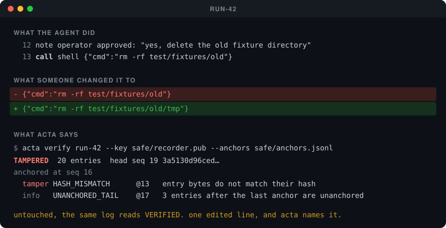

<div align="center">

# Acta

### A logbook the driver can write in but cannot tear pages out of

**An AI agent deletes a folder. Then someone edits the log to say it deleted less.**
**Acta reads the log back and names the line that was changed.**

<br/>



**A real run.** The edited line, and what Acta printed about it.
[See it happen](#the-thirty-second-version) · [Run it yourself](#run-it-yourself) · [What it cannot catch](#what-this-does-not-prove)

<br/>

[](./LICENSE)
[](./test)
[](#the-attack-table)
[](./package.json)
[](https://github.com/patkusch/acta/actions/workflows/test.yml)

</div>

---

## The thirty-second version

An AI agent is asked to fix a failing test. On the way, the operator lets it delete an old folder, and it does. Acta writes down each step as it happens:

> **entry 12** — *note:* operator approved: "yes, delete the old fixture directory"
> **entry 13** — *shell:* `rm -rf test/fixtures/old`

Checked straight after the run, the log comes back clean:

```
$ acta verify run-42 --key safe/recorder.pub --anchors safe/anchors.jsonl
VERIFIED  20 entries  head seq 19 3a5130d96ced…
anchored at seq 16
  info   UNANCHORED_TAIL    @17   3 entries after the last anchor are unanchored
```

Now someone opens the log file and changes entry 13, so the agent seems to have deleted only a small corner of that folder:

```diff
- {"cmd":"rm -rf test/fixtures/old"}
+ {"cmd":"rm -rf test/fixtures/old/tmp"}
```

The file still reads perfectly well. Check it again:

```
$ acta verify run-42 --key safe/recorder.pub --anchors safe/anchors.jsonl
TAMPERED  20 entries  head seq 19 3a5130d96ced…
anchored at seq 16
  tamper HASH_MISMATCH      @13   entry bytes do not match their hash
  info   UNANCHORED_TAIL    @17   3 entries after the last anchor are unanchored
```

**Acta says the log was changed, and points at entry 13.**

That is the easiest trick in the book. Acta is tested against twelve ways of doctoring a log, up to someone who holds Acta's own signing key. With a copy of that key and a checkpoint kept somewhere the agent cannot reach, it catches eleven. The twelfth, changes made by the key holder since the last checkpoint, it cannot catch, and [says so](#what-this-does-not-prove).

---

## What it is

An agent runs for an hour and takes two hundred actions. Afterwards someone asks
what happened. The usual answer is a log written by the same process that took
the actions, on a disk the agent could write to, in a format the agent could
edit. That is not a record. That is the agent's account of itself.

Acta is a small library, a verifier, and an MCP proxy. Every tool call and its
result goes into an append-only ledger where each entry commits to the one
before it and is signed by a key the agent must not hold. The verifier tells
you whether the ledger has been touched — and, more usefully, exactly which
attackers it can and cannot catch.

## Run it yourself

```bash
npm install
npm test          # 78 tests: the chain, the recorder, the proxy, resume, key rotation, definition binding, the GitHub witness sink and its ledger, and every attack in the catalogue
npm run attack    # the demo: twelve attacks, three verifier configurations, one cell that stays red

# record a real MCP server
node bin/acta.mjs mcp --dir /var/acta/run-42 --anchor-every 10 --anchor-to /var/anchors/run-42 \
  -- npx @modelcontextprotocol/server-filesystem ~/projects

# afterwards
node bin/acta.mjs show   /var/acta/run-42
node bin/acta.mjs verify /var/acta/run-42 --key /var/anchors/recorder.pub --anchors /var/anchors/run-42
```

No runtime dependencies. Node 22.6 or later (it runs TypeScript directly).

The story above is the first row of the attack table, `edit in place`, run by hand through the CLI.

---

## The mechanism

Three things bind an entry into place. Each one defeats a stronger attacker than
the last, and none of them defeats the strongest.

| | binds | defeats |
|:--|:--|:--|
| `hash` | the entry's own bytes | anyone who edits a line |
| `prev` | the previous entry's hash | anyone who deletes or reorders lines |
| `sig` | Ed25519 over the hash, by the recorder's key | anyone who understands the format but does not hold the key |
| **anchor** | the head hash, written somewhere the agent cannot write | **anyone who holds the key**, for entries up to the anchor |

An entry looks like this. Everything except `hash` and `sig` is hashed, in a
canonical form (sorted keys, no whitespace, nothing JSON cannot represent).

```json
{"v":1,"seq":7,"prev":"3d0a…","ts":"2026-09-02T21:00:08.000Z","kind":"call",
 "id":"c3f1…","tool":"shell","args":{"cmd":"rm -rf test/fixtures/old"},
 "def":{"seq":3,"digest":"e0b4…"},
 "hash":"9b41…","sig":"MEUCIQ…"}
```

Seven kinds: `open` (genesis, declares the session and the public key), `call`,
`result` (which cites its call and carries the body inline or by digest),
`note`, `rotate` (retires the signing key and declares its successor), `resume`
(marks a recorder restart and names the head it continues from), and `close`
(which records the counts and which calls were still open).

A `call` may also carry `def`: the seq of the recorded `tools/list` result the
agent was shown and the digest of this tool's definition in it. The verifier
follows that reference and recomputes the digest, so a call cannot quietly
drift away from the definition it was made against — see
[binding calls to definitions](#binding-calls-to-definitions).

## Three verdicts, not two

`acta verify` does not say "valid". It says one of:

- **tampered** — a check failed. The findings say which entry and how.
- **consistent** — the ledger agrees with itself. That is all. A ledger rewritten
  end to end by whoever holds the key is consistent. So is one that was truncated
  to hide its last twenty actions.
- **verified** — consistent, signed by a key *you* supplied from outside the ledger
  directory, and matching an anchor *you* supplied from somewhere the agent could
  not write. This is the only verdict that means what people want "valid" to mean,
  and even then only up to the anchor.

The verifier lists what is missing before a `consistent` ledger could become
`verified`. `--strict` makes `consistent` a non-zero exit, for CI.

A session that crashed mid-call is not tampering. Its last call has no result
and there is no `close`; the verifier reports `UNANSWERED_CALL` as a warning
and the verdict stands. The same file with its tail cut off looks identical —
which is why the truncate row in the table below is caught by nothing but an
anchor. A result that is missing when the `close` entry says it should be there
is a different matter: that is `RESULT_REMOVED`, and it is tampering.

```
$ acta verify run-42
CONSISTENT  4 entries  head seq 3 db121670a2ec…
  info   SELF_ATTESTED_KEY   signatures checked against the key the ledger itself declares; whoever rewrote the ledger could have declared their own
consistent is not verified. still missing:
  - a public key obtained outside the ledger directory (--key)
  - an anchor written where the agent cannot write (--anchors)

$ acta verify run-42 --key safe/recorder.pub --anchors safe/anchors.jsonl
VERIFIED  4 entries  head seq 3 db121670a2ec…
anchored at seq 2
  info   UNANCHORED_TAIL    @3    1 entries after the last anchor are unanchored
```

## The attack table

`npm run attack` records a genuine session — an agent fixing a flaky test,
deleting a fixture directory with a noted approval, posting to a webhook — then
runs twelve attacks against it. Each attack is labelled with what the attacker
needs. Each is verified three ways: the chain alone, chain plus a trusted key,
chain plus key plus anchor. The catalogue is in
[`src/attacks.ts`](src/attacks.ts) and asserted in
[`test/attacks.test.ts`](test/attacks.test.ts), so the table below cannot drift
from the code.

```
attack                            needs     chain   +key    +anchor
edit in place                     file      caught  caught  caught
delete the entry                  file      caught  caught  caught
reorder                           file      caught  caught  caught
truncate                          file      —       —       caught
forge an approval                 format    caught  caught  caught
edit and rechain                  format    caught  caught  caught
rewrite under own key             own key   —       caught  caught
rewrite with the real key         real key  —       —       caught
lose the outcome, real key        real key  —       —       caught
redefine the tool, real key       real key  caught  caught  caught
redefine and rebind, real key     real key  —       —       caught
after the last anchor, real key   real key  —       —       —

  the chain alone catches 6 of 12: anyone who can write the file but does not understand it.
  a trusted key catches 7: anyone who does not hold the recorder's key.
  an anchor catches 11: anyone who holds the key, for entries up to the anchor.
  nothing catches 1: the key holder, between the last anchor and now.
```

Three rows deserve a second look.

**Truncate** is caught by nothing but the anchor. A ledger with its last twenty
lines cut off is a perfectly valid shorter ledger; it looks exactly like a
session that crashed. Hash chains do not protect against this and it is the
easiest attack on the list — it needs no understanding of the format at all.

**Redefine the tool** is a real-key attack that the chain alone catches. Not
because the chain can see through a signature — it cannot — but because every
call carries the digest of the definition it was made against, and the attacker
rewrote the definition without rewriting the calls. The next row is what
happens when they do: caught by the anchor, and by nothing else. A
cross-reference costs the key holder one more edit. It does not stop them.

**After the last anchor** is caught by nothing. If the agent holds the key, or
the key was ever within its reach, every entry since the last anchor is the
agent's word. This is not a limitation to engineer around; it is the shape of
the problem. The two operational rules follow directly from it:

1. **The key lives where the agent cannot read it.** A separate process, a
   directory outside every confinement the agent's tools are given, a different
   user. The MCP proxy holds the key in its own process for this reason.
2. **Anchor often, somewhere else.** An anchor is one line — it fits in a commit
   message, a chat channel, a ticket, an append-only file owned by another user.
   `--anchor-every N` in the proxy, `rec.anchor(path)` in the library.

## What this does not prove

- **Only what passed through the recorder.** If the agent has a channel that
  bypasses the recorded tool surface, the ledger is silent about it. Acta records
  a boundary; it does not discover one.
- **Ordering, not time.** `prev` proves that entry 8 was written after entry 7.
  `ts` is the recorder's clock and is only asserted. A key holder can write any
  timestamp they like, subject to the verifier's monotonicity warning.
- **An anchor is as good as where you put it.** An anchor the agent can overwrite
  is decoration. The library makes anchors small, and `--append-to` makes a local
  sink the kernel will not let the agent rewrite, but neither can beat putting the
  anchor somewhere the agent has no write at all.
- **Single writer.** One recorder, one key, one session per file. This is not a
  distributed log and does not pretend to be. There is no consensus and no
  witness set. If you need multiple independent parties to attest, the anchor is
  the thing to hand them.
- **A missing ledger is not a finding.** If the whole directory is deleted, the
  only evidence it existed is an anchor somewhere else with no ledger to match.
  `verify` on a directory with no ledger reports `MISSING`, which is all it can do.
- **Large results are stored by digest.** Bodies over 4 KiB go to a blob store
  beside the ledger. A missing blob is reported as a warning — evidence lost, not
  evidence altered — and the digest still binds whatever is later produced.

## Using it as a library

```ts
import { Recorder } from './src/recorder.ts';

const rec = Recorder.open('/var/acta/run-42', { actor: 'coding-agent' });

// wrap a bag of async tools; every call and result is recorded
const tools = rec.wrap({ read_file, edit_file, shell, http_post });
await tools.shell({ cmd: 'npm test' });          // → call, then result (or a recorded failure)

// or record by hand
const id = rec.call('approve', { what: 'delete fixtures' });
rec.result(id, { by: 'operator', decision: 'yes' });
rec.note('operator was shown the consent card, not a summary of it');

rec.anchor('/var/anchors/run-42');               // one line, appended
rec.anchor('/var/anchors/run-42', { appendOnly: true }); // kernel-enforced append-only sink
console.log(rec.anchorLine());                   // acta-anchor session=… seq=… hash=… — paste it anywhere
rec.close();
```

Verification is a pure function over parsed entries, so it can run anywhere:

```ts
import { readLedger, loadPublicKey } from './src/ledger.ts';
import { readAnchors } from './src/anchor.ts';
import { verifyLedger } from './src/verify.ts';

const { entries, problems } = readLedger('/var/acta/run-42');
const verdict = verifyLedger(entries, {
  problems,
  trustedKey: loadPublicKey('/var/anchors/recorder.pub'),
  anchors: readAnchors('/var/anchors/run-42'),
});
// verdict.status: 'tampered' | 'consistent' | 'verified'
// verdict.findings: [{ code, severity, seq, message }]
// verdict.missing: what stands between this ledger and 'verified'
```

## The MCP proxy

`acta mcp -- <command>` wraps any stdio MCP server. Everything is forwarded
untouched; every `tools/call` and its response is recorded, with `isError`
results marked as failures. `tools/list` is recorded too, as a call whose
result is the catalogue, so the definitions the agent was shown sit in the same
chain as the calls it made against them, and every `tools/call` after it is
bound to that catalogue — a later reader can tell what the agent was told a
tool would do, not just what it did. Anchors are taken on call *completion*, so a
pipelined burst of requests cannot double-anchor. The proxy prints each anchor
line to stderr as it takes one, which is a cheap way to get anchors into a
host's own log.

```
acta init   [dir]                                   create a ledger directory and key pair
acta verify [dir] [--key pem] [--anchors file] [--git] [--witness file] [--strict] [--json]
acta anchor [dir] [--to file] [--append-to file] [--git] [--github owner/name[:branch] [--github-path file] [--witness-out file] [--witness-ledger file]]
acta witness backup [witnesses.jsonl | dir] --to <path | owner/name[:branch]> [--backup-path file]
acta witness add witness.json [--ledger file]        file an older witness.json once GitHub confirms it
acta verify --witnesses witnesses.jsonl [--json]     check every recorded witness against GitHub
acta show   [dir]                                   print the timeline
acta mcp    [--dir d] [--resume [--rotate-on-resume]] [--anchor-every N] [--anchor-to file | --anchor-append-to file] -- <command> [args...]
```

Exit codes from `verify`: 0 verified (or consistent without `--strict`),
1 tampered, 3 consistent under `--strict`. `verify --witnesses` uses 0 clean,
1 tampered, 2 GitHub could not be reached (not a finding), 3 the ledger is
empty.

### Binding calls to definitions

A tool is what its definition says it is. `shell` described as "not sandboxed"
is a different tool from `shell` described as "runs in a throwaway sandbox",
and an agent that read the second and did the first was misled, not reckless.
So the proxy treats a `tools/list` result as the catalogue in force, and every
`tools/call` after it carries `def`: the seq of that catalogue entry and the
sha256 of this tool's definition inside it, computed from the same bytes the
ledger recorded. The verifier follows the reference and recomputes the digest.

What that buys, and what it does not:

- **Each call names the definition it was made against.** When a server
  changes its definitions mid-session and the host lists again, the ledger has
  two catalogues, and every call says which one it was made under. A
  `notifications/tools/list_changed` from the server is recorded as a note;
  calls stay bound to the last catalogue the host actually fetched, because
  that is what the agent saw. After a `--resume`, the definitions in force are
  read back from the ledger, so calls before the host lists again are still
  bound.
- **Calls the catalogue does not cover are flagged.** A call to a tool the
  catalogue in force does not list is `UNLISTED_TOOL`: the agent called
  something it was never shown. A call after a catalogue with no binding at
  all is `UNBOUND_CALL`. Both are warnings — the record is consistent, just
  less informative. Calls made before any catalogue was listed are not flagged.
- **It is one more thing a key holder must keep consistent.** Rewriting the
  recorded definition of `shell` to say it was sandboxed — the edit a tool
  author would most want — now needs every `shell` call rebound as well, or
  `DEF_MISMATCH` fires with the chain alone. Rebinding is not hard for someone
  with the key; the attack table has both rows, and the second is caught only
  by an anchor. This is a cross-reference, not a defence against the key
  holder. Nothing in this file is.
- **It says nothing about what the server did with the call.** A server that
  lists one definition and executes another is outside the recorded boundary,
  exactly as the tool's side effects are. The ledger proves what the agent was
  told and what it asked for; it never saw what ran.

### Resuming after a restart

One session is one ledger file, and by default the recorder refuses to reopen
one — a second `open` would be a second genesis, and the verifier says so. But a
recorder that *crashed* leaves a ledger with no `close`, and the run is not over.
`acta mcp --resume` (and `Recorder.resume(dir)` in the library) continues that
ledger instead of refusing it, so a restarted proxy records into the same
session rather than starting a fresh one beside it.

Resume is deliberately narrow, because reopening a record is exactly where a
forgery would hide:

- **It verifies before it continues.** The existing chain is checked against the
  recorder's own key first; a tampered, wrong-key, or broken ledger is refused,
  not appended to. Resuming onto a corrupt base would launder it.
- **A clean `close` is final.** The verifier reads anything after a `close` as
  tampering, so there is nowhere sound to append. To continue past a close, start
  a new session. Only an un-closed (crashed) ledger can be resumed.
- **The restart is on the record.** The first entry written is a `resume` marker
  naming the head it continues from. `RESUME_MISMATCH` makes that claim
  uncounterfeitable — its `fromHash` must equal its own `prev` — so even a key
  holder cannot forge a continuity that did not happen.
- **A call in flight at the crash stays open.** Its outcome happened in the gap
  and was never seen, so it is reported as `UNANSWERED_CALL`, not invented.

### Rotating the key

The signing key can change without ending the session. `Recorder.rotate(newKeys)`
retires the current key and continues under a new one, writing a `rotate` entry
that declares the successor. Two things make this safe:

- **The rotation is signed by the *outgoing* key.** It is the current holder's
  authorisation of the next key, so trust flows forward along a signed
  succession. Someone who cannot sign with the current key cannot insert a
  rotation — the `rotate`'s own signature is checked against the retiring key,
  and a forged one is `BAD_SIGNATURE`.
- **You verify with the *original* key, and it covers the whole chain.** Hand a
  reviewer the genesis key; the verifier follows each rotation to the next and
  checks every entry against the key in force when it was written. The current
  on-disk key is *not* the verification key — verifying against it fails at
  genesis with `KEY_MISMATCH`, which is the point: the root of trust is the key
  the session opened with, not the one it happens to hold now.

`acta mcp --rotate-on-resume` rotates on restart, before recording anything more.
If whatever took the recorder down also exposed its key, the blast radius stops
at the restart: entries after it are signed by a fresh key, and the original
still verifies everything before it. This is the answer to the resume caveat that
a recorder coming back holds a key that may have been exposed in the gap.

### Anchoring into git

`acta anchor <dir> --git` appends the anchor line as a git note on `HEAD` under
`refs/notes/acta`; `acta verify <dir> --git` reads every anchor back from that
ref. Locally this is no stronger than a file the same user can write. The point
is the next step:

```bash
git push origin refs/notes/acta                      # a copy the agent needs push rights to alter
git fetch origin refs/notes/acta:refs/notes/acta     # a reviewer verifies against that copy, not the local one
```

### An append-only anchor sink

Anchoring off the machine is the strong move; when it has to stay local, the
anchor file is only as safe as its permissions. `acta anchor <dir> --append-to
<file>` (and `acta mcp --anchor-append-to <file>`) writes to a file the kernel
marks append-only — `chflags uappnd` on macOS and the BSDs. With the flag set,
the OS permits appends and refuses truncation, in-place rewrite and unlink.

Append-only is precisely the right strength, and no more, because **anchors are
monotonic evidence**. An attacker holding the recorder key can append a new
anchor that matches a rewritten ledger — the sink allows that — but cannot
remove the honest anchor already in the file, and one surviving honest anchor no
longer matches the rewrite, so the rewrite is caught. More anchors can only
catch more, never fewer.

The honest boundary: `uappnd` is a *user* flag its owner can clear with `chflags
nouappnd`. It stops an agent whose tools are read, write and delete but not
`chflags`; it does not stop the file's owner, and it is not the system-immutable
flag (`schg`, root and a reboot to clear). On Linux — where the equivalent is
`chattr +a` and needs `CAP_LINUX_IMMUTABLE` — the command refuses rather than
writing a file that only looks protected. This is a higher local bar, not a
substitute for anchoring somewhere the agent has no write at all.

### A public anchor witness

Everything above is local: a file, a git ref, this machine's kernel. `acta
anchor <dir> --github owner/name[:branch]` (and, in the library,
`writeGitHubAnchor`) puts the anchor somewhere genuinely outside the machine —
a public GitHub repository — and hands back a **witness**: the repository,
branch, file, the exact commit SHA the anchor landed in, the commit's
timestamp, and which line of the file it is — and files a copy of it in a
local [witness ledger](#the-witness-ledger). `acta verify --witness
witness.json` does not trust that record. It re-fetches the commit and the
file **from GitHub, by that commit's SHA**, and confirms the anchor is really
there before letting it count towards the verdict.

**What this proves.** A commit has a SHA computed from its own content and
its parent, and GitHub stamps it with a timestamp of its own. Neither is
something the party writing the anchor gets to choose after the fact. Once
`verify --witness` has independently confirmed a commit exists with that SHA
and that anchor inside it, two things follow: the anchor existed by that
time, and it was written where changing it later means changing history that
other people can already see. That is what a transparency log is fundamentally
for — an existence proof, and a record that is hard to quietly rewrite — even
without a dedicated transparency-log protocol underneath it.

**What this does not prove, plainly.** GitHub — or anyone with push rights to
that repository, which for `patkusch/acta-anchors` is `patkusch` alone — can
force-push the branch and discard the commit the witness points at. Unlike
the append-only file sink, nothing here stops that at the moment it happens.
The one thing standing between a force-push and it working is: is the
discarded commit still fetchable by its SHA? GitHub keeps orphaned commits
reachable for a while (dangling-commit garbage collection is not immediate),
but nothing here guarantees how long, and it is not a promise this project can
make on GitHub's behalf.

**What actually defends against it** is a copy of the witness records kept
where the person who could force-push cannot reach. That used to be advice.
It is now a feature, described next.

#### The witness ledger

Every `acta anchor --github` also writes its witness, as one line, into
`witnesses.jsonl` — next to your anchors file, or wherever `--witness-ledger`
points. The line holds the repository, branch, file, commit SHA, commit
timestamp, line number, and the anchor itself (which carries the session id and
the ledger-head digest). The file only ever grows. acta refuses to add to a
damaged one, checks after each write that the earlier bytes are still there,
and stops *before* pushing anything if the ledger is not in a state to be
written to.

```
acta witness backup .acta --to /Volumes/usb/witnesses.jsonl   # a folder you control
acta witness backup .acta --to yourname/acta-witness-backup   # or a second GitHub repo
acta verify --witnesses .acta/witnesses.jsonl                 # ask GitHub about every record
```

**`backup`** copies the ledger to a second place: a local path (a USB stick, a
synced folder) or a second GitHub repository, written through the same code the
anchor sink uses. Run it twice and the second run does nothing. Run it after
more anchors and it adds only the new lines. It will not overwrite a backup that
holds a line the ledger does not have, or that disagrees with the ledger on a
line both have. That is the tamper signal running the other way: it means the
ledger was cut short or rewritten after the backup was made, or something else
wrote to the backup. Nothing is overwritten and the command exits 1. (A bare
`owner/name` is read as a GitHub repository unless it is, or sits in, a path
that exists; write `./` or `github:` to be certain. A GitHub backup is as
public as its repository, and the ledger holds your session ids.)

**`verify --witnesses`** asks GitHub about every record, by commit SHA, and
prints one line each:

| result | what it means | exit |
|:--|:--|:--|
| `OK` | the commit is there, with that timestamp, holding that anchor on that line, and the branch head still begins with the log exactly as that commit saw it | 0 |
| `WITNESS_REWRITTEN` | your ledger says this commit was pushed; GitHub can no longer produce it. It existed, so it was discarded — a force-push or a replaced repository | 1 |
| `LOG_PREFIX_CHANGED` | the branch head no longer begins with the earlier lines in order: one was changed or removed, or the file is gone. This catches a rewrite even while the old commit can still be fetched | 1 |
| `WITNESS_UNREACHABLE` | GitHub did not answer (no network, rate limit, expired login). Not a finding either way, and never counted as a pass | 2 |

Other findings from the single-witness check (`WITNESS_CONTENT_MISMATCH` and
the rest, see the findings reference) also print, and a line in the ledger that
cannot be read is `WITNESS_LEDGER_MALFORMED`, also tamper. One rewritten record
is not diluted by another record that could not be reached: tamper wins the
summary. The check works the same on a backup, so a backup on its own is enough
to convict.

**What this proves.** The reason a force-push used to work is that "commit not
found" reads like a typo. With your own record saying the commit was there, it
reads as what it is. And because the head is compared with what each commit
saw, a rewrite is caught even in the days before GitHub cleans up the old
commit.

**What this still cannot do.**

- **A rewrite before the first backup is undetectable.** Until a copy exists
  somewhere the rewriter cannot reach, the ledger and the repository are two
  things one person with your machine and your GitHub login can change
  together. `acta anchor --github` says so each time it files a witness.
- **A backup is only as far away as you put it.** A folder on the same disk, or
  a second repository the same login can force-push, is a copy the same person
  can rewrite. A USB stick or a synced folder the agent's account cannot
  write is the stronger choice.
- **An anchor that was pushed but never filed is not in the ledger.** If the
  process dies between the push and the write (or the ledger refuses the write),
  there is no record to hold GitHub to. acta prints the witness so it can be
  filed with `witness add`; a kill leaves nothing.
- **"Not found" from a private repository can also mean "your login cannot see
  it."** The wrong `gh` account reads as `WITNESS_REWRITTEN`. A witness
  repository should be public, and this is one more reason.
- **GitHub itself is still one party.** A GitHub that answered the same wrong
  thing to every request would fool this. That is the gap a real transparency-log
  network closes, and this does not.

The real run, on 2026-09-18, against the two witnesses already pushed to
[`patkusch/acta-anchors`](https://github.com/patkusch/acta-anchors) — the
ledger rebuilt from GitHub's own API, nothing typed in by hand:

```
$ acta verify --witnesses witnesses.jsonl
OK   bf3d0fec8689  patkusch/acta-anchors@main anchors.jsonl:0  seq 3  3e762b44  2026-09-16T21:00:38Z
OK   787a9bd58a43  patkusch/acta-anchors@main anchors.jsonl:1  seq 3  3e762b44  2026-09-16T21:01:00Z
CLEAN  2 records in witnesses.jsonl, every one still on GitHub, and no log has lost a line it had.
```

The tamper cases are not shown against that repository, because proving them
for real would mean force-pushing it. They live in
[`test/witness-ledger.test.ts`](test/witness-ledger.test.ts), against a fake
GitHub, including the command line end to end. The one live probe run was
read-only: a copy of the ledger with one digit of a SHA changed came back
`WITNESS_REWRITTEN`, exit 1, and with the network cut it came back
`WITNESS_UNREACHABLE`, exit 2.

**Why the GitHub witness exists at all, historically.** Rekor's `hashedrekord`
entry needs an Ed25519**ph** signature — the pre-hashed variant of Ed25519,
RFC 8032 §5.1.6 — and as of 2026-09-16, when this GitHub sink was built,
Node's `node:crypto` only signed plain Ed25519; the pre-hash mode was not
exposed, and no other piece of this project's toolchain filled the gap
either. A GitHub commit sidesteps that entirely rather than waiting on it,
at the cost of a weaker, centrally-run witness instead of a dedicated
transparency-log network with independent operators and inclusion proofs.
That blocker was re-checked for real on 2026-09-22 and turned out to no
longer hold — see [the next section](#a-public-transparency-log-witness-rekor).
`writeGitHubAnchor` implements the same `AnchorSink` interface the Rekor sink
now also implements, so the recorder and verifier never had to change for
either.

```ts
import { writeGitHubAnchor, verifyGitHubWitness } from './src/github-anchor.ts';
import { appendWitness, backupWitnessLedger, parseBackupTarget, verifyWitnessLedger } from './src/witness-ledger.ts';

const witness = writeGitHubAnchor(anchor, { repo: 'patkusch/acta-anchors' });
// { provider: 'github', repo, branch, path, commitSha, committedAt, line, anchor }

verifyGitHubWitness(witness).ok  // re-fetches by commitSha; does not trust the record alone

// and, from src/witness-ledger.ts: file it, back it up, check the lot
appendWitness('witnesses.jsonl', witness);
backupWitnessLedger('witnesses.jsonl', parseBackupTarget('/Volumes/usb/witnesses.jsonl'));
verifyWitnessLedger('witnesses.jsonl').verdict  // 'clean' | 'tampered' | 'unreachable' | 'empty'
```

### A public transparency-log witness (Rekor)

The README used to say a real Sigstore Rekor entry was blocked on two
things at once: Node's `node:crypto` cannot produce an Ed25519ph signature,
and Rekor's public write path was thought to be shaky mid-migration to
`rekor-tiles` (Rekor v2). Re-checked for real on 2026-09-22, instead of
assuming either was still true:

- **The signature gap is closed.** `@noble/curves` 2.4.0 exports
  `ed25519ph` (`@noble/curves/ed25519.js`), a real RFC 8032 §5.1
  implementation — signed and verified against the RFC's own §7.3 test
  vector (message `"abc"`) byte-for-byte before any of this was wired up.
  This is the project's first runtime dependency, pinned exact rather than
  a range. Node's own `generateKeyPairSync('ed25519')` keys work with it —
  the two libraries derive the same public key from the same seed and
  cross-verify each other's plain-Ed25519 signatures — so PEM/SPKI key
  export still goes through `node:crypto` everywhere it can; `@noble/curves`
  is used for exactly the one thing Node cannot do.
- **The write path was never really the blocker.** `rekor.sigstore.dev`
  (Rekor v1) is still the public-good instance's default log — Rekor v2 is
  GA, but the public instance has not cut over — and `hashedrekord` v0.0.1
  has taken Ed25519ph keys since
  [sigstore/rekor#1945](https://github.com/sigstore/rekor/pull/1945),
  merged 2024-03-04. `/api/v1/log/entries` answered a live GET and a live
  POST when checked directly. Reading `pkg/signature/ed25519ph.go` in
  `sigstore/sigstore` settled the one open question — what a hashedrekord
  entry with an Ed25519ph key actually needs: `data.hash.algorithm` must be
  `sha512`, and the signature is produced by signing the artifact directly
  (Ed25519ph does its own SHA-512 prehash internally, per the RFC), not by
  signing an externally-computed digest.

`src/rekor-anchor.ts`'s `writeRekorAnchor` submits a `hashedrekord` entry for
an anchor and returns a `RekorWitness`: the UUID, log index, log ID,
integrated time, and the raw public key used to sign — enough for
`verifyRekorWitness` to re-fetch the entry **by UUID** later and check it
independently, the same pattern as the GitHub witness re-fetching by commit
SHA rather than trusting the record it was handed.

**What `verifyRekorWitness` actually checks**, all against a fresh fetch,
never the witness's own cached fields: the entry's data hash really is
SHA-512 of the anchor line; the entry's Ed25519ph signature really verifies
against that anchor and the public key the witness names; the entry's
`logID` and `integratedTime` match what was recorded; and — the part a
transparency log is actually for — the inclusion proof Rekor hands back
**recomputes to the root it claims**, via a real RFC 6962 Merkle audit-path
implementation (leaf hash, inner nodes, border nodes) ported from and
checked against `transparency-dev/merkle`'s `proof.go`, the same code
Rekor's own client uses. That recomputation was proven against a real,
independently-fetched entry (`rekor.sigstore.dev`, log index 1, a 22-hash
proof against a tree with over 4.1 million entries) before any of this was
written, and it is checked again as a fixture-based unit test in
[`test/rekor-anchor.test.ts`](test/rekor-anchor.test.ts).

**The real submission, done once, for real, on 2026-09-22:** a genuine acta
session (open, one call, one result, close) anchored to
`rekor.sigstore.dev`, fetched back by UUID, and verified:

```
uuid:            108e9186e8c5677a1e69c0dc0dc221fc96bc03a2087d5539615e8bb0b1a5b60f481ac6665ffeb67f
logIndex:        2909493026
logID:           c0d23d6ad406973f9559f3ba2d1ca01f84147d8ffc5b8445c224f98b9591801d
integratedTime:  1790083678  (2026-09-22T13:27:58Z)
verifyRekorWitness(witness).ok → true, findings: []
```

Tamper cases run for real too, against that live entry: a witness claiming
the wrong public key comes back `REKOR_PUBLIC_KEY_MISMATCH`; a witness
pointed at a UUID that does not exist comes back `REKOR_ENTRY_NOT_FOUND`,
not `REKOR_UNREACHABLE` — same distinction the GitHub witness draws between
"the server said no" and "the server did not answer." A public search UI
entry exists for this submission at
[search.sigstore.dev](https://search.sigstore.dev/?logIndex=2909493026).

**What this proves**, same shape as the GitHub witness: the anchor existed
by the time it was integrated, checkably by anyone, against a real
transparency log rather than one party's commit history.

**What this does not prove yet**, and the [Not built](#not-built) section
says so precisely: `verifyRekorWitness` does not check the checkpoint's own
signature (the signed statement of the root hash the inclusion proof is
checked against), and it checks one submission at a time, not consistency
across submissions the way the witness ledger does for GitHub. A dishonest
log could still forge the root hash it answers with — though not without
also producing a valid Ed25519ph signature from a key that signed something
else, which is the part this module's checks actually anchor their trust
in.

```ts
import { writeRekorAnchor, verifyRekorWitness } from './src/rekor-anchor.ts';
import { generateKeyPairSync } from 'node:crypto';

// A dedicated Ed25519 identity for this witness role — caller manages persistence.
const { privateKey } = generateKeyPairSync('ed25519');
const secretKey = Buffer.from(privateKey.export({ format: 'jwk' }).d, 'base64url');

const witness = writeRekorAnchor(anchor, { secretKey });
// { provider: 'rekor', rekorUrl, uuid, logIndex, logID, integratedTime, publicKeyHex, anchor }

verifyRekorWitness(witness).ok  // re-fetches by uuid; recomputes the Merkle inclusion proof from scratch
```

| finding | severity | meaning |
|:--|:--|:--|
| `REKOR_ENTRY_NOT_FOUND` | tamper | the UUID this witness names does not exist at that Rekor instance any more |
| `REKOR_HASH_MISMATCH` | tamper | the entry's `data.hash` is not SHA-512 of the anchor this witness claims |
| `REKOR_SIGNATURE_MISSING`, `REKOR_SIGNATURE_INVALID` | tamper | the entry has no signature, or it does not verify against the claimed anchor and key |
| `REKOR_PUBLIC_KEY_MISMATCH` | tamper | the entry's public key is not the one the witness names |
| `REKOR_LOG_ID_MISMATCH`, `REKOR_INTEGRATED_TIME_MISMATCH` | tamper | the entry's logID or integration time disagree with what was recorded |
| `REKOR_BODY_UNPARSEABLE` | tamper | the entry's body is not the JSON a hashedrekord entry should be |
| `REKOR_INCLUSION_PROOF_MISSING`, `REKOR_INCLUSION_PROOF_INVALID` | tamper | no inclusion proof was returned, or it does not recompute to the claimed root |
| `REKOR_UNREACHABLE` | warn | Rekor did not answer (network, rate limit) — never a pass, never tamper on its own |

## Findings reference

| code | severity | meaning |
|:--|:--|:--|
| `HASH_MISMATCH` | tamper | entry bytes do not hash to their `hash` |
| `CHAIN_BREAK` | tamper | `prev` is not the previous entry's hash |
| `SEQ_BREAK` | tamper | sequence numbers are not contiguous from 0 |
| `BAD_SIGNATURE` | tamper | signature does not verify against the key in use |
| `KEY_MISMATCH` | tamper | the ledger declares a different key than the one you trust |
| `BAD_GENESIS`, `SECOND_GENESIS` | tamper | the first entry is not a valid `open`, or there is another |
| `AFTER_CLOSE` | tamper | entries follow the `close` |
| `ORPHAN_RESULT`, `DUPLICATE_RESULT`, `DUPLICATE_CALL` | tamper | a result without a call, or a second of either |
| `RESULT_REMOVED` | tamper | a call has no result and `close` does not list it as open |
| `DEF_MISMATCH` | tamper | a call's bound definition digest is not what the cited catalogue holds, or that catalogue does not define the tool |
| `BAD_DEF_REF` | tamper | a call is bound to a seq that is not an earlier `tools/list` result |
| `COUNT_MISMATCH` | tamper | `close` counts disagree with the ledger |
| `BODY_MISMATCH`, `BLOB_MISMATCH` | tamper | a result body does not match its digest |
| `TRUNCATED` | tamper | an anchor points past the end of the ledger |
| `ANCHOR_MISMATCH` | tamper | the anchored entry has a different hash |
| `RESUME_MISMATCH` | tamper | a `resume` marker names an origin that is not the entry before it |
| `BAD_ROTATE_KEY` | tamper | a `rotate` entry declares an unreadable successor key |
| `UNPARSEABLE` | tamper | a line is not an entry |
| `MISSING`, `EMPTY` | tamper | no ledger file, or a ledger with no entries |
| `UNANSWERED_CALL` | warn | a call has no outcome and the session did not close |
| `CLOCK_REGRESSION` | warn | a timestamp precedes the one before it |
| `BLOB_MISSING` | warn | a large result body is not in the blob store |
| `UNLISTED_TOOL` | warn | a call names a tool the catalogue in force does not list |
| `UNBOUND_CALL` | warn | a call made after a catalogue carries no binding to a definition |
| `SELF_ATTESTED_KEY` | info | no `--key` was given; the ledger vouched for itself |
| `UNANCHORED_TAIL` | info | entries after the last anchor are the key holder's word |
| `DEF_UNCHECKED` | info | the bound catalogue's body is not available here, so the binding was not checked |

`verify --witness` runs one more check, outside `verifyLedger` (it needs the
network; the rest of this table does not): `WITNESS_COMMIT_NOT_FOUND` the
commit is not fetchable by that SHA, `WITNESS_FILE_NOT_FOUND` the file is not
readable at that commit, `WITNESS_CONTENT_MISMATCH` the line at that commit is
not the anchor claimed, `WITNESS_LINE_MISSING` the file at that commit is
shorter than the claimed line, `WITNESS_TIMESTAMP_MISMATCH` GitHub's own
commit timestamp does not match the one recorded — all tamper. In a witness
ledger, `WITNESS_COMMIT_NOT_FOUND` is reported as `WITNESS_REWRITTEN` (the ledger
proves the commit existed) and `LOG_PREFIX_CHANGED` is added (see [the witness
ledger](#the-witness-ledger)). A check that could not get an answer from GitHub
at all is `WITNESS_UNREACHABLE`, a warning, and never a pass: single-witness
`verify` exits 2 for it. A failed witness check is reported and fails `verify`
on its own, whatever the ledger's own verdict says.

## Layout

```
<dir>/
  ledger.jsonl      the record, one entry per line, append-only
  recorder.key      Ed25519 private key, mode 0600 — keep this away from the agent
  recorder.pub      the public key; copy it somewhere else and verify against the copy
  blobs/<digest>    result bodies too large to inline
  anchors.jsonl     the default anchor file, which is the weakest place to put one
  witnesses.jsonl   the witness ledger, written by `acta anchor --github` (or beside --to's file)
```

## Not built

- **Checkpoint-signature and log-consistency verification for the Rekor
  witness.** [`RekorAnchorSink` submits to a real transparency log and
  recomputes a real Merkle inclusion proof](#a-public-transparency-log-witness-rekor)
  — the recomputation is genuine, not decorative, and checked against real
  fetched log data. What it does not yet do: verify the checkpoint's own
  signature (so a dishonest log could still forge the root hash the
  inclusion proof is checked against, though not without also forging a
  valid signature from a key that signed something else), and it checks one
  submission at a time rather than log consistency over repeated
  submissions the way [the witness ledger](#the-witness-ledger) does for
  the GitHub sink. Closing this needs porting `pkg/verify/verify.go`'s
  `VerifyCheckpointSignature` (a "signed note" format, not plain
  ECDSA-over-SHA256) and something like a `witness-ledger.ts` for Rekor
  entries specifically. Dated 2026-09-22 — see the section linked above for
  what was actually checked before writing this, and why the Ed25519ph
  blocker this used to be filed under turned out not to be the real one any
  more.

## License

MIT.
